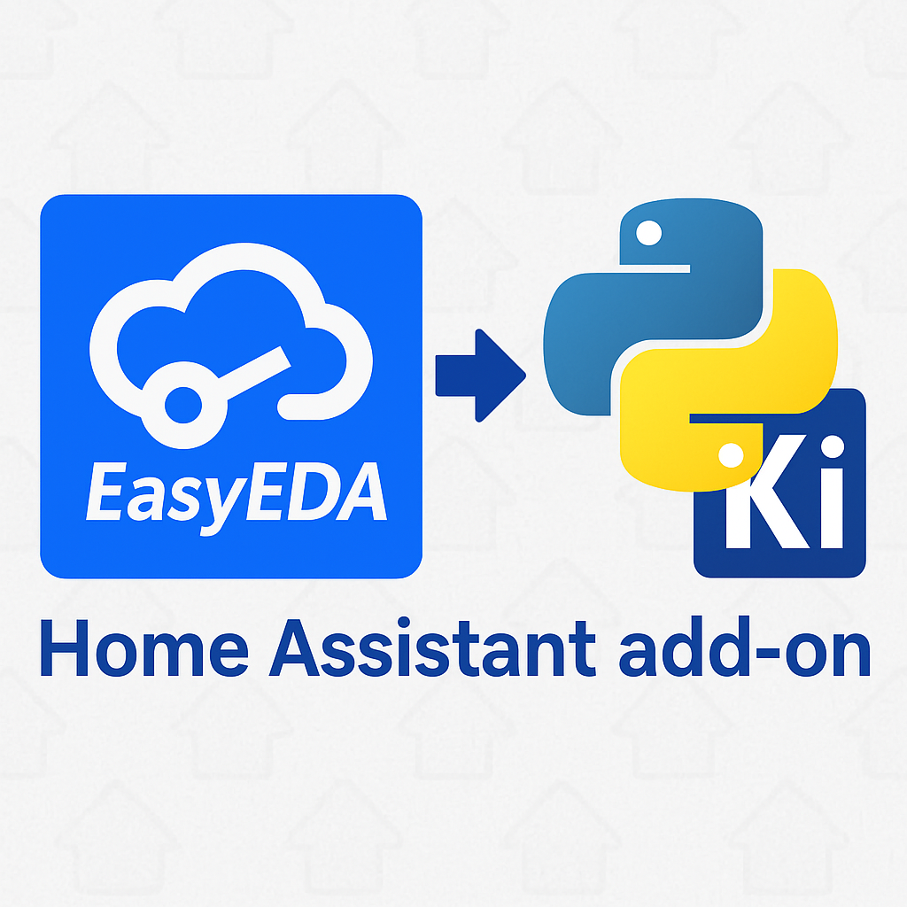

# 🧰 EasyEDA to KiCad Web - Home Assistant Add-on

Convert EasyEDA components and part lists into KiCad libraries with a clean, mobile-friendly web interface — directly inside Home Assistant!



---

## 🌟 Features

- Convert by **LCSC ID** or upload **CSV** of part numbers
- Generates KiCad-compatible libraries
- ✨ Ingress-enabled — runs inside Home Assistant UI
- 🌓 Dark mode support
- 📱 Mobile-friendly responsive design
- Automatic file cleanup (customizable)

---

## 🧱 Installation

### 🔌 Manual Method

1. Copy this folder to your Home Assistant `addons` directory:
   ```
   /addons/easyeda_to_kicad_web/
   ```

2. Go to **Settings > Add-ons > Add-on Store > ⋮ > Repositories** and hit **Reload**.
3. The add-on will appear. Click **Install**, then **Start**.
4. Click **Open Web UI** to launch the app!

---

## ⚙️ Configuration Options

You can modify the following options in the add-on settings:

```yaml
cleanup_days: 7             # How many days to keep files
disable_auto_cleanup: false # Prevents deletion of old files
page_size: 20               # Pagination size in file listing
```

---

## 🧪 Developer Notes

This add-on runs a Python script served through a lightweight web server.
You can extend functionality by modifying `easyeda_to_kicad.py`.

---

## 📁 File Mapping

- `/share` and `/config` are mapped with read-write access
- Ingress port: `7860`

---

## 🧑‍💻 Author

Developed by [killerQueen](https://github.com/killerQueen69)

---

## 🧾 License

MIT
